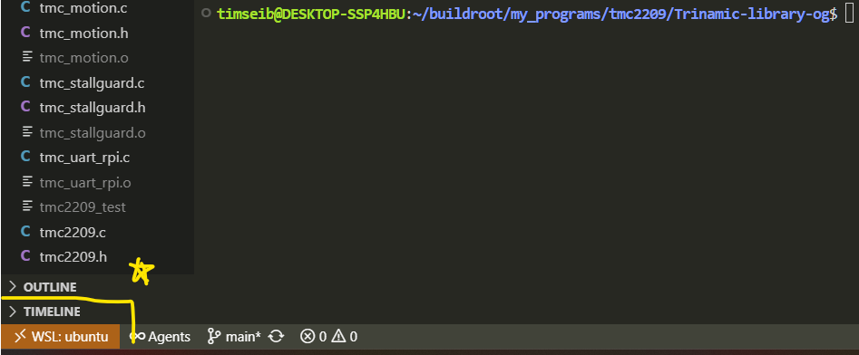
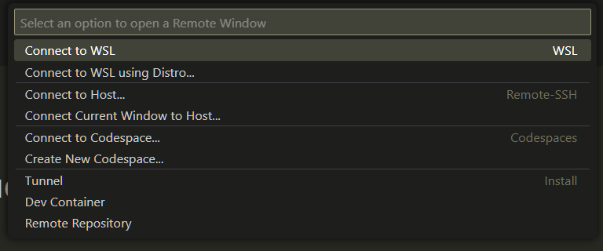

# Trinamic Stepper Motor Driver Library

## Overview

This library provides a comprehensive interface for the tmc2209, it includes a multi threaded interface for controlling the steps of the motor, monitoring MSCNT register, and providing a stallguard interrupt interface in case of motor overload. The gpio structure is also defined along with a UART interface for communication with the tmc2209 registers. 

## Supported Drivers

- **TMC2209** - Silent stepper driver with UART interface

## Key Features

- **S-Curve** - S-curve motion profile is implemented, able to calculate proper velocity and acceleration for given microstep resolution and other user parameters
- **Stallguardv2** - Stall guard is enabled making the motor safe for over current situations, cool step also allows the motor to move at lower current, saving power
- **MSCNT Monitoring** - Constant monitoring of the MSCNT register gives accurate measure of motor position relative to sent pulses, ensuring accuracy and detection of error
- **UART** - Custom UART interface created using 'termios' as the C API for UART connection
- **Graceful Shutdown** - System interrupts are properly handled and the state of the motor can be correct saved for recovery, unexpected power off triggers recovery mode to home lightbar to close

### TMC2209 Specific Features

- **StealthChop Mode** - Silent operation with PWM current control, low velocities
- **CoolStep** - Automatic current reduction for energy efficiency
- **StallGuard** - Stall detection for endstop-less homing
- **UART Interface** - Simple single-wire communication
- **1-256 Microsteps** - Ultra-smooth motion with interpolation

## File Structure

```
├── tmc2209.h          # TMC2209 register definitions and API
├── tmc2209.c          # TMC2209 implementation
├── tmc_gpio.h         # RPI gpio definitions and API
├── tmc_gpio.c         # RPI gpio implementation with libgpio v1.6
├── tmc_motion.h       # Step motion thread definitions
├── tmc_motion.c       # Step motion thread implementation
├── tmc_monitor.h      # MSCNT monitoring thread definitions
├── tmc_monitor.c      # MSCNT monitoring thread implementation 
├── tmc_uart_rpi.c     # UART interface for raspberry pi using termios
├── move_lightbar.c    # Main function to perform movement of lightbar, takes argument debug level
└── README.md          # Information on implementation of entire system
```
## Quick Start

### 0. Setup (Windows)

1. Ensure you have buildroot installed and the proper image is able to be flashed

2. Open WSL on VSCODE or equivalent and use remote connected (bottom left corner of window) to connect to WSL
    

    
3. Navigate to the buildroot directory and create a programs development folder

4. Clone this directory (or whatevever source code you have)
```bash
    git clone git@github.com:TimSeib/tmc2209_dev.git
```
5. run make to compile programs and see "tests" folder to access binaries

6. Use tool like WinSCP to transfer files from Windows machine to Raspberry PI

7. See make file (lines 1-7) to see how to compile programs in such a way that they work on our system

8. BONUS: I recommend you create a couple local variables in your baschrc
```bash
    # fix path for my system
    export PATH=/usr/local/sbin:/usr/local/bin:/usr/sbin:/usr/bin:/sbin:/bin:/usr/games:/usr/local/games:/usr/

    CROSS_COMPILER=~/buildroot/output/host/bin/aarch64-buildroot-linux-gnu-
```
This makes it so that your path is correct for the WSL (doesn't include windows paths) and the CROSS_COMPILER is now an env variable
so you can run things like: 
```bash
    ${CROSS_COMPILER}gcc -o water_level waterlevel.c -lgpiod
```


### 1. Basic Initialization

```c
#include "tmc2209.h"

// Create driver instance
TMC2209_t driver;

// Set default configuration
TMC2209_SetDefaults(&driver);

// Configure motor parameters
driver.config.motor.address = 0;        // UART address
driver.config.current = 500;            // 500mA RMS
driver.config.microsteps = 16;          // 16 microsteps
driver.config.r_sense = 110;            // 110mOhm sense resistor

// Initialize the driver
if (!TMC2209_Init(&driver)) {
    // Handle initialization error
}
```

### 2. Motion Control Setup

```c
#include "tmc_motion.h"
#include "tmc_gpio.h"

// Initialize GPIO context
tmc_gpio_context_t gpio_ctx;
tmc_gpio_init(&gpio_ctx);

// Initialize motion control
tmc_motion_s_curve_t motion;
tmc_motion_s_curve_init(&motion, &gpio_ctx, &driver);

// Start S-curve motion
tmc_motion_s_curve_start(&motion, 
    90.0f,           // target_angle_degrees
    60.0f,           // max_speed_rpm
    2.0f,            // max_accel_hz_per_sec
    0.1f,            // jerk_rate_hz_per_sec2
    50.0f,           // start_speed_hz
    0.5f,            // start_accel_hz_per_sec
    1.0f,            // gear_ratio
    false,            // direction (false = counter-clockwise)
    16                // microstep_resolution
);
```

### 3. Position Monitoring

```c
#include "tmc_monitor.h"

// Position monitoring is automatically started with motion
// Get current status
uint32_t step_count;
uint16_t mscnt;
int16_t error;
uint64_t last_update;
bool valid = tmc_position_monitor_get_status(&motion.position_monitor, 
    &step_count, &mscnt, &error, &last_update);

// Get error statistics
int32_t total_error;
uint32_t check_count;
float average_error;
tmc_position_monitor_get_error_stats(&motion.position_monitor, 
    &total_error, &check_count, &average_error);
```

### 4. StallGuard Configuration

```c
#include "tmc_stallguard.h"

// Configure StallGuard
tmc_stallguard_config_t sg_config = {
    .diag_pin = 25,           // GPIO pin for DIAG signal
    .threshold = 3,            // Stall threshold (lower = more sensitive)
    .min_speed_threshold = 1500, // Minimum speed for StallGuard
    .callback = NULL           // Stall callback function
};

tmc_stallguard_init(&driver, &sg_config);

// Setup monitoring with GPIO context
tmc_stallguard_setup_monitoring(&driver, &gpio_ctx, stall_callback_function);
```

## Configuration Options

### Operating Modes
- **StealthChop** - Silent operation, best for low-speed applications (default)
- **SpreadCycle** - High performance, best for high-speed applications
- **CoolStep** - Energy efficient, automatically reduces current

### Motion Control
- **S-Curve Profile** - Jerk-controlled acceleration/deceleration with 7 phases
- **Speed Control** - Configurable from 10-500 Hz with automatic timer period calculation
- **Acceleration Control** - Configurable from 0.1-10 Hz/sec with jerk rate limiting
- **Microstep Resolution** - 1, 2, 4, 8, 16, 32, 64, 128, or 256 microsteps

### Current Settings
- **Run Current** - Current during motion (0-2000mA typical)
- **Hold Current** - Current when stationary (0-100% of run current)
- **Hold Delay** - Time before switching to hold current

### Chopper Configuration
- **Off Time** - Chopper frequency (1-15, higher = lower frequency)
- **Hysteresis** - Current control precision
- **Blanking Time** - Noise filtering (16-54 clock cycles)

## Hardware Requirements

### TMC2209 Pin Connections
- **UART_TX** - Single-wire UART transmit
- **UART_RX** - Single-wire UART receive (optional)
- **ENN** - Enable pin (active low)
- **STEP** - Step input
- **DIR** - Direction input
- **DIAG** - StallGuard diagnostic output
- **VCC** - 5V supply
- **VM** - Motor supply voltage
- **GND** - Ground

### Sense Resistor
- **External** - 110mOhm recommended (default)
- **Internal** - 60mOhm (requires configuration change)

### GPIO Requirements
- **Raspberry Pi** - Uses libgpio v1.6 for GPIO control
- **Step/Dir/Enable** - Standard stepper motor control pins
- **DIAG Pin** - Interrupt-capable GPIO for StallGuard monitoring

## Communication Interface

The library uses a UART-based communication protocol with the following characteristics:
- **Baud Rate** - 115200 (default)
- **Data Format** - 8N1
- **Protocol** - Single-wire UART with CRC8
- **Addressing** - Up to 256 devices on one bus
- **Implementation** - Uses termios API for UART communication

## Motion Control System

### S-Curve Motion Profile
The library implements a sophisticated 7-phase S-curve motion profile:

1. **Acceleration Jerk Increase** - Acceleration ramps up linearly
2. **Acceleration Constant** - Maximum acceleration maintained
3. **Acceleration Jerk Decrease** - Acceleration ramps down to zero
4. **Constant Speed** - Maximum speed maintained (if trapezoidal profile)
5. **Deceleration Jerk Increase** - Deceleration ramps up linearly
6. **Deceleration Constant** - Maximum deceleration maintained
7. **Deceleration Jerk Decrease** - Deceleration ramps down to zero

### Position Monitoring
- **MSCNT Register Polling** - Real-time microstep position tracking
- **Error Detection** - Continuous comparison of expected vs actual position
- **Step Boundary Polling** - Polls at full-step boundaries for efficiency
- **Position Persistence** - Maintains position across power cycles using memory-mapped files

### StallGuard Integration
- **Automatic Stall Detection** - Monitors DIAG pin for motor stall conditions
- **Configurable Thresholds** - Adjustable sensitivity and speed thresholds
- **Interrupt-Based Monitoring** - Uses GPIO interrupts for immediate response
- **Callback System** - User-defined stall handling functions

## API Reference

### Core TMC2209 Functions
- `TMC2209_Init()` - Initialize driver
- `TMC2209_SetDefaults()` - Set default configuration
- `TMC2209_SetCurrent()` - Configure motor current
- `TMC2209_GetCurrent()` - Read current settings
- `TMC2209_SetMicrosteps()` - Set microstep resolution
- `TMC2209_SetTPWMTHRS()` - Set StealthChop threshold
- `TMC2209_SetTCOOLTHRS()` - Set CoolStep threshold

### Motion Control Functions
- `tmc_motion_s_curve_init()` - Initialize S-curve motion control
- `tmc_motion_s_curve_start()` - Start S-curve motion with parameters
- `tmc_motion_s_curve_stop()` - Stop motion and disable motor
- `tmc_motion_s_curve_is_complete()` - Check if motion is finished
- `tmc_motion_s_curve_get_progress()` - Get motion progress percentage

### Position Monitoring Functions
- `tmc_position_monitor_init()` - Initialize position monitoring
- `tmc_position_monitor_start()` - Start position monitoring thread
- `tmc_position_monitor_get_status()` - Get current position and error status
- `tmc_position_monitor_get_error_stats()` - Get accumulated error statistics

### StallGuard Functions
- `tmc_stallguard_init()` - Initialize StallGuard with configuration
- `tmc_stallguard_setup_monitoring()` - Setup GPIO monitoring for stall detection
- `tmc_stallguard_check_triggered()` - Check if stall condition is detected
- `tmc_stallguard_reset_triggered()` - Reset stall detection state

### GPIO Control Functions
- `tmc_gpio_init()` - Initialize GPIO context
- `tmc_gpio_write()` - Write to GPIO pin
- `tmc_gpio_enable_driver()` - Enable/disable motor driver
- `tmc_gpio_setup_diag_interrupt()` - Setup DIAG pin interrupt

### Register Access
- `TMC2209_WriteRegister()` - Write to driver register
- `TMC2209_ReadRegister()` - Read from driver register
- `TMC2209_GetRegPtr()` - Get pointer to shadow register

## Advanced Features

### Multi-Threaded Architecture
- **Motion Thread** - Handles step generation and timing
- **Position Monitor Thread** - Continuously monitors MSCNT register
- **GPIO Event Thread** - Monitors StallGuard interrupts
- **Thread Synchronization** - Mutex-protected data access

### Position Persistence
- **Memory-Mapped Files** - Maintains step count across power cycles
- **Automatic Recovery** - Detects and restores previous position state
- **Real-Time Sync** - Continuous disk synchronization for reliability

### Error Handling and Recovery
- **CRC Validation** - UART communication integrity checking
- **Interface Counter Verification** - Communication reliability monitoring
- **Position Error Detection** - Continuous accuracy monitoring
- **Graceful Shutdown** - Proper cleanup on unexpected termination

## Troubleshooting

### Common Issues
1. **No Communication** - Check UART configuration and wiring
2. **High Current** - Verify sense resistor value and current settings
3. **Motor Noise** - Adjust chopper settings or switch to StealthChop mode
4. **Stall Detection** - Configure StallGuard threshold properly
5. **Position Drift** - Check microstep resolution and direction settings
6. **Thread Conflicts** - Ensure proper initialization order and cleanup

### Debug Features
- **Comprehensive Logging** - Multi-level logging system (trace, debug, info, warn, error)
- **Interface Counter Verification** - UART communication reliability checking
- **CRC Error Detection** - Data integrity validation
- **Status Register Monitoring** - Real-time register value tracking
- **Position Error Statistics** - Accumulated error tracking and averaging
- **StallGuard Status** - Complete StallGuard configuration and status reporting

### Performance Monitoring
- **Step Timing Analysis** - Microsecond-precision step timing
- **Position Accuracy Tracking** - Continuous MSCNT vs expected position comparison
- **Error Accumulation** - Long-term position error statistics
- **Motion Phase Tracking** - Real-time S-curve phase identification

## Integration Examples

### Standalone Motion Control
```c
// Complete motion control example
tmc_gpio_context_t gpio_ctx;
TMC2209_t driver;
tmc_motion_s_curve_t motion;

// Initialize all components
tmc_gpio_init(&gpio_ctx);
TMC2209_SetDefaults(&driver);
TMC2209_Init(&driver);
tmc_motion_s_curve_init(&motion, &gpio_ctx, &driver);

// Start motion
tmc_motion_s_curve_start(&motion, 180.0f, 60.0f, 2.0f, 0.1f, 50.0f, 0.5f, 1.0f, true, 16);

// Wait for completion
while (!tmc_motion_s_curve_is_complete(&motion)) {
    usleep(10000); // 10ms
}

// Cleanup
tmc_motion_s_curve_deinit(&motion);
tmc_gpio_deinit(&gpio_ctx);
```

### StallGuard Integration
```c
// StallGuard callback function
void stall_callback(void) {
    log_warn("Motor stall detected - stopping motion");
    // Implement stall handling logic
}

// Setup StallGuard monitoring
tmc_stallguard_config_t sg_config = {
    .diag_pin = 25,
    .threshold = 3,
    .min_speed_threshold = 1500,
    .callback = stall_callback
};

tmc_stallguard_init(&driver, &sg_config);
tmc_stallguard_setup_monitoring(&driver, &gpio_ctx, stall_callback);
```

## TODO

### Missing Documentation
- **UART Configuration Details** - Specific UART setup requirements
- **GPIO Pin Mapping** - Default pin assignments and configuration
- **Performance Benchmarks** - Speed and accuracy measurements
- **Error Code Reference** - Complete list of error codes and meanings
- **Configuration File Format** - If configuration files are supported
- **Build Instructions** - Compilation and linking requirements
- **Dependency Management** - Required system libraries and versions

### Unclear Implementation Details
- **Memory Management** - Memory allocation and cleanup strategies
- **Thread Priority** - Thread scheduling and priority configuration
- **Power Management** - Sleep modes and power consumption optimization
- **Fault Tolerance** - Error recovery and system resilience
- **Calibration Procedures** - Motor and system calibration methods

## License

This library is provided under the BSD license. See the individual source files for license details.

## Contributing

Contributions are welcome! Please ensure:
- Code follows the existing style
- New features are properly documented
- Tests are included for new functionality
- Thread safety is maintained
- Error handling is comprehensive

## Version History

- **v1.0.0** - Complete motion control system with S-curve profiles, position monitoring, and StallGuard integration
- **v0.0.9** - Enhanced documentation, improved error handling
- **v0.0.8** - Added comprehensive register documentation
- **v0.0.7** - Improved current calculation accuracy
- **v0.0.6** - Added CoolStep configuration support
- **v0.0.5** - Initial TMC2209 support

---

*Last updated: 2024-12-19*
